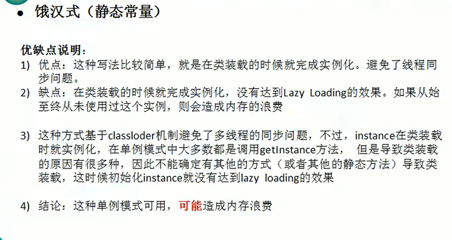
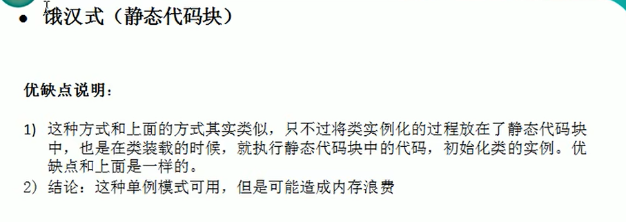
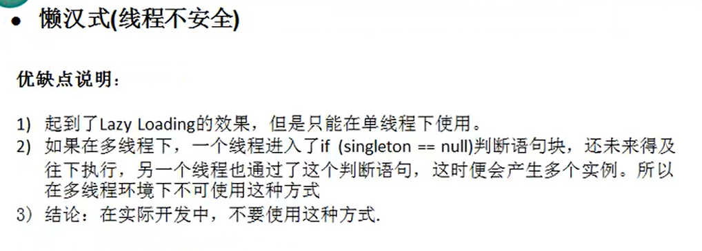
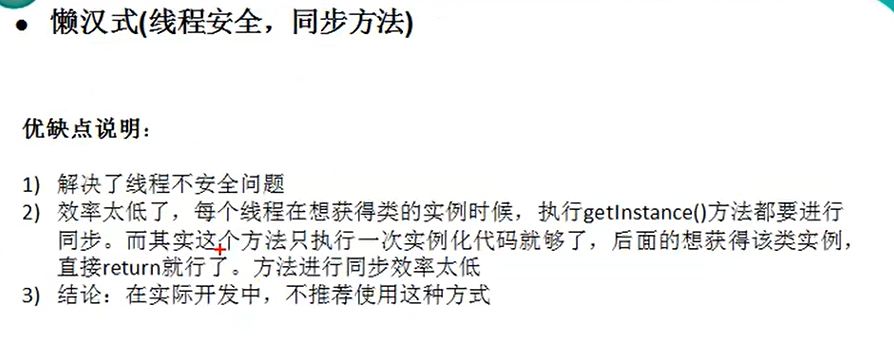
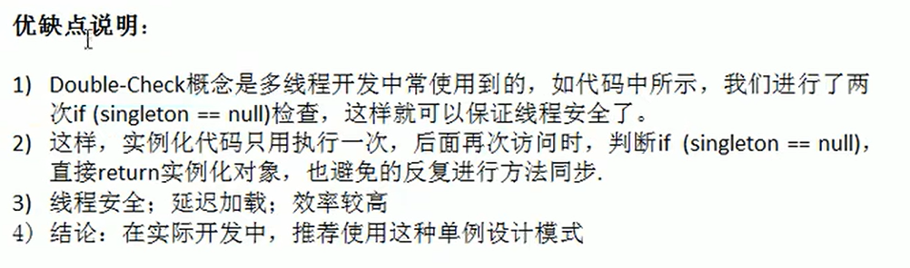
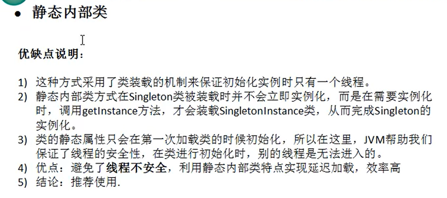
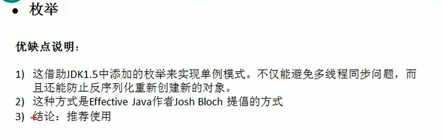
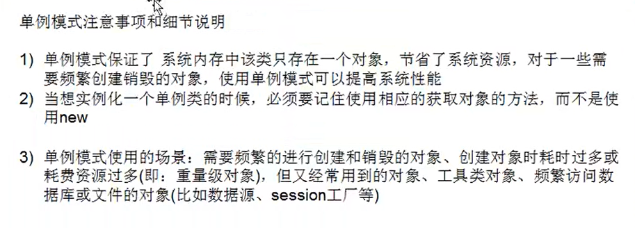

# 设计模式学习
## 1 单例模式
### 1.1 饿汉式
#### 1.1.1 静态常量饿汉式
(1) 构造器私有化(防止new一个对象)

(2) 类的内部创建对象

(3) 向外暴露一个静态的公共方法(getInstance)

(4) 代码实现如下
```java
class Singleton {
    private Singleton() {
    }
    private final static Singleton instance = new Singleton();
    public static Singleton getInstance() {
        return instance;
    }
}
```


#### 1.1.2 静态代码块饿汉式
```java
class Singleton {
    private Singleton() {}
    static { // 在静态代码块中创建单例对象
        instance = new Singleton();
    }
    private static Singleton instance;
    public static Singleton getInstance() {
        return instance;
    }
}
```

### 1.2 懒汉式
#### 1.2.1 线程不安全的懒汉式
```java
class Singleton {
    private static Singleton singleton;
    private Singleton() {}
    // 提供一个静态的公有方法，使用该方法时，才去创建instance，即懒汉式
    public static Singleton getInstance() {
        if(singleton == null){
            singleton = new Singleton();
        }
        return singleton;
    }
}
```

#### 1.2.2 线程安全的懒汉式(同步方法)
```java
class Singleton {
    private static Singleton singleton;
    private Singleton() {}
    public static synchronized Singleton getInstance() {
        if(singleton == null){
            singleton = new Singleton();
        }
        return singleton;
    }
}
```

#### 1.2.3 线程安全的懒汉式(DoubleCheck)
```java
class Singleton {
    private static volatile Singleton singleton; // volatile可以防止指令重排，并且保证可见性
    private Singleton() {}
    public static Singleton getInstance() {
        if(singleton == null){
            synchronized (Singleton.class) {
                if(singleton == null) {
                    singleton = new Singleton();
                }
            }
        }
        return singleton;
    }
}
```

### 1.3 静态内部类实现单例模式
```java
class Singleton {
    private static Singleton instance;
    private Singleton() {}
    private static class SingletonInstance {
        private static final Singleton INSTANCE = new Singleton();
    }
    public static Singleton getInstance() {
        return SingletonInstance.INSTANCE;
    }
}
```

### 1.4 枚举方式实现单例模式
```java
enum Singleton {
    INSTANCE; // 属性
    public void sayOk() {
        System.out.println("ok");
    }
}
```

### 1.5 单例模式在jdk源码中的应用
```java
public class Runtime {
    private static final Runtime currentRuntime = new Runtime();
    private static Version version;
    public static Runtime getRuntime() {
        return currentRuntime;
    }
    private Runtime() {}
}
```
Jdk源码中Runtime类采用的时静态常量方式的饿汉式单例。
## 1.6 单例模式总结

